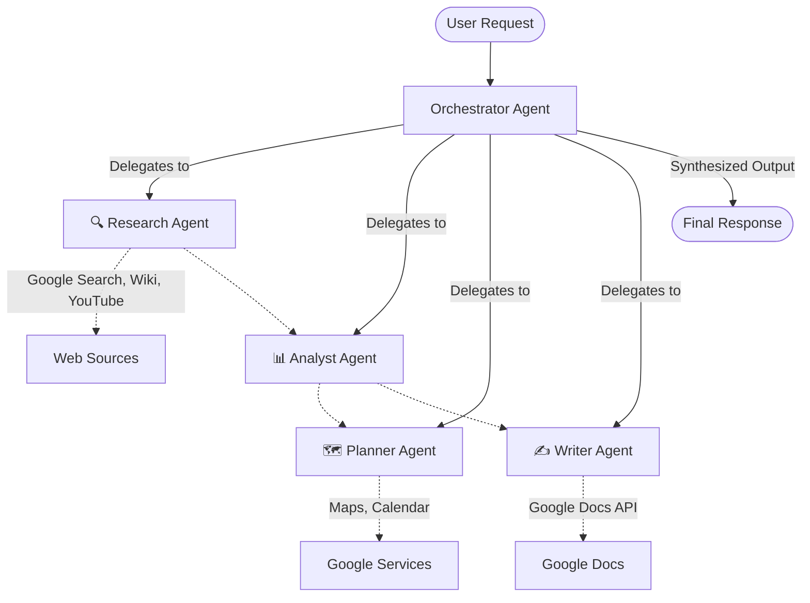

# 🌌 AgentVerse — Multi-Agent Research & Action Platform

 <!-- Update the banner link if you have a specific banner image -->

**AgentVerse** is a powerful multi-agent AI system built using **Google's Agent Development Kit (ADK)** and **Gemini 2.0 Flash**. It coordinates specialized AI agents to help users research, analyze, plan, and create across any domain. 

Whether you need to research a complex topic, plan a multi-day itinerary, or draft comprehensive reports, AgentVerse breaks your request down into a multi-step workflow and delegates tasks to the right agents in the right order.

---

## ✨ Features

- **Multi-Agent Orchestration**: A central `OrchestratorAgent` parses user intent and delegates intelligently.
- **Deep Research**: Leverages Google Search, Wikipedia, and YouTube APIs for comprehensive data gathering.
- **Data Synthesis**: An Analyst Agent strictly responsible for structuring and synthesizing raw data into insights.
- **Action-Oriented Planning**: Integrates with Google Maps and Google Calendar for actionable itineraries and event scheduling.
- **Content Generation**: Creates ready-to-use Google Docs directly from synthesized data.
- **State-of-the-Art LLM**: Powered by Google's Gemini 2.0 Flash via Vertex AI in Google Cloud.

---

## 🏗️ Architecture



---

## 🤖 Meet the Agents

| Agent Name | Primary Capabilities | Tools Used | Use Case |
|------------|-----------------------|------------|----------|
| **Orchestrator Agent** | Task Parsing, Delegation, Synthesis | Sub-Agents | Understands complex requests, breaks them down into steps, and coordinates the other 4 agents. |
| **Research Agent** | Information Retrieval | Google Custom Search, Wikipedia Search, YouTube Data API | Finding facts, statistics, videos, trends, and gathering raw information on any topic. |
| **Analyst Agent** | Synthesis, Fact-Checking, Structuring | Native LLM Analytics | Organizing raw research into actionable insights, comparing options, and creating summaries. |
| **Planner Agent** | Scheduling, Location Finding | Google Maps Places API, Google Calendar API | Creating travel itineraries, finding locations, scheduling events, and timelines. |
| **Writer Agent** | Content Creation | Google Docs API | Creating reports, scripts, outlines, guides, and comprehensive summaries directly as Google Docs. |

---

## 💻 Tech Stack

- **Backend Logic**: Python, FastAPI
- **AI Framework**: Google Gen AI SDK (Agent Development Kit/ADK)
- **Model**: Gemini 2.0 Flash (`gemini-2.0-flash`) via Google Cloud Vertex AI
- **Frontend**: Vanilla HTML/JS/CSS served via FastAPI static files
- **Integrations**: Multiple Google Cloud APIs (Custom Search, Maps, YouTube, Docs, Calendar)

---

## ⚙️ Getting Started

### Prerequisites
- Python 3.10+
- A Google Cloud Project with the following APIs enabled:
  - Vertex AI API
  - Custom Search API
  - YouTube Data API v3
  - Google Docs API
  - Google Calendar API
  - Places API (New)

### Setup & Installation

**1. Clone the repository**
```bash
git clone https://github.com/mrmallick07/AgentVerse.git
cd AgentVerse
```

**2. Create a Virtual Environment**
```bash
python3 -m venv venv
source venv/bin/activate
# For Windows: venv\Scripts\activate
```

**3. Install Dependencies**
```bash
pip install -r requirements.txt
```

**4. Set Environment Variables**
Create a `.env` file in the root directory (based on `.env.example` if available) and add:
```env
GOOGLE_CLOUD_PROJECT=your-google-project-id
GOOGLE_CLOUD_LOCATION=us-central1
GOOGLE_API_KEY=your-legacy-api-key-if-needed # Vertex AI takes precedence
GOOGLE_APPLICATION_CREDENTIALS=/path/to/your/client_secret.json
GOOGLE_CSE_ID=your-custom-search-engine-id
```

**5. Authenticate with Google Cloud (Vertex AI)**
Since the backend forces Vertex AI (`GOOGLE_GENAI_USE_VERTEXAI="TRUE"`), you must have default credentials set up.
```bash
gcloud auth application-default login
```

**6. Run the Application**
Start the FastAPI server:
```bash
uvicorn backend.main:app --reload
```
The server will start on `http://127.0.0.1:8000`.

### Using the Application
Navigate to `http://127.0.0.1:8000` in your browser. You will see the AgentVerse web UI. Enter a complex prompt like:
> _"Research the history of artificial intelligence, analyze its key milestones, create a timeline document, and schedule a 1-hour review session for tomorrow."_

Watch the Orchestrator delegate tasks down the chain!

---

## 📝 License

This project is open-source and available under the terms of the MIT License.
